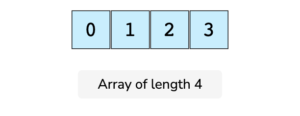
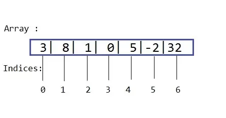

<h1 align=center><b>Array</b></h1>

Har qanday dasturlash tilida bu nomlar boshqacha atalsada Computer Science da ularning nomi bitta bo'ladi. Java dasturlash tilida ham bu tushuncha aynan **Array**ligicha qoladi.

Array bu elementlar to'plami bo'lgan va eng ko'p ishlatiladigan Data Structurelardan biri xisoblanadi. Data Structurelarning aksariyati (masalan, Stack va Queue) Array strukturasi yordamida keltirib chiqariladi, shuning uchun u Data Structurelarning  asoslaridan biri sifatida tanilgan. Ushbu ma'lumotlar tuzilmalari keyingi boblarda kengroq muhokama qilinadi. Arrayning maqsadi tezkor kirish (access qilish) uchun moslashtirilgan ma'lumotlarni guruhlashdir.

Pastdagi ramsga qarang, biz u yerda 4 ta elementdan iborat Array yaratdik. Har bir element **data element** deb ataladi va elementlar soni esa array uzunligi (length) bo'ladi. Birinchi va oxirgi elementdan tashqari har bir elementni 2ta qo'shnisi borligini ko'rishingiz mumkin.



<br>

## **Index - Indeks**

Har bir data element **index** deb nomlangan raqamlarga biriktirilgan. **Index** esa bu element joylashuv o'rni degani.



**Index**lar mavjud bo'lganligi uchun ham biz elementlarga tezkor kira olamiz. Aks xolda biz butun elementlar bo'yicha iteratsiya qilishimizga to'g'ri kelar edi huddi Linked List (kelasi mavzularda o'tiladi) kabi.

Ularning ichidagi elementlarni access qilish ya'ni kirish uchun biz **index**lardan foydalanamiz. Yuqoridagi rasmda ko'rib turganingizdek sanoq 1 dan emas 0 dan boshlangan.

> **Xazil**: Agar sizga biror dasturchi sen mening birinchi muhabbatimsan desa ishonmang. Chunki dasturlashda sanoq 0dan boshlanadi. 😉

## **Types of Arrays - Array turlari**

Array o'z ichiga primitive data-typedagi (`int, char, floats, boolean, byte, short, long va h.k.z.`) ma'lumotlarni va non-pirimitve (`Java Objects va h.k.z.`) larni yoki boshqa arraylarni ham saqlay oladi. Ularni biz ikki turga bo'lamiz:
 - One Dimensional Array
 - Multi-Dimensional Array

<br>

## **One Dimensional Array - Bir o'lchovli Array**

Array tuzishda siz doim uning data-typeini va nomini kiritib o'tishingiz lozim.

```java
datatype arrayName[];
// yoki 
datatype[] arrayName;
```

```java
class OneDArray {
 public static void main(String args[]) {
  //Declaration Syntax
  int myArray1[];
  int[] myArray2;
 }
}
```

Yuqoridagi kod kompilyatorga `myArray1` va `myArray2` o'zgaruvchilari `int` tipidagi array. Hozircha hech qanday haqiqiy massiv mavjud emas. Ushbu o'zgaruvchilarni haqiqiy array ga aylantirish uchun biz `new` operator yordamida bittasini yaratishimiz kerak, xuddi pastdagi formuladagidek:

```java
arrayName = new type [size];
```

```java
class OneDArray {
 public static void main(String args[]) {
  // Sintaksisni tuzib oldik.
  int myArray[];

  // Array tuzish.
  myArray = new int [4];

  // Array ichidagi elementlarga kirish.
  for (int i = 0; i < myArray.length; i++){
      System.out.println(myArray[i]);
  } 
 }
}
```

Davomi bor...

## **Challenges**

1. [Merge Two sorted list](https://leetcode.com/problems/merge-two-sorted-lists/)
2. [Find two number that sums up to K](https://www.google.com/search?q=Find+two+number+that+up+to+k&oq=Find+two+number+that+up+to+k&aqs=chrome..69i57.6405j0j9&sourceid=chrome&ie=UTF-8)


<pre align=center> <a href="./Doc.md">⬅️ Ortga qaytish</a>     <a href="./Linked%20List.md">➡️ Keyingi darsga o'tish</a></pre>

<!--  -->