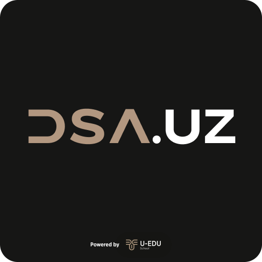

    
    <h1 align=center><b>DSA.UZ </b></h1>

"Ma'lumotlar strukturasi va Algoritmlar" mavzusidagi tasavvurga boy va o'zbek tilidagi qo'llanma!

<h2 align=center><b>Kirish</b></h2>

`DWCE` (Documentation With Code Exmpales) - Principle bo'yicha yozilgan ushbu qo'llanmada siz o'zingiz o'rganayotgan yoki biladigan dasturlash tilida Algoritmlar va Data Strukturalar qanday qo'llanilishini o'rganishingiz mumkin!

Loihani yozishda biz asosan 3ta "princple"ga amal qildik.
1. **What and Why?** - `X` o'zi nimaligi va nima uchun kerakligi
2. **Imagine** - `X`ni qanday ishlashini illustratsiyalar bilan tushuntirish.
3. **How** - `X`ni dasturlash tilida kod orqali qanday ifoda qilish mumkinligi

Qo'llanmada ba'zi xatoliklarga yo'l qo'ygan bo'lishimiz mumkin. Shuni inobatga olib aytishim kerakki agarda xatolik topsangiz Issues bo'limida xatolik qayerdaligini aytib keting. 

Agar loihani qo'llab quvatlamoqchi bo'lsangiz, biz contribute uchun ochiqmiz va pull requestlarni loyiq deb topsak uni qabul qilamiz. Taklif va xatoliklarni Issues bo'limida **New Issue** orqali berib ketishingiz mumkin. Oldindan Rahmat 😊

Unday bo'lsa boshladik 🚀!

<h2 align=center><b>Dasturlash tili</b></h2>

Ushbu dokumentatsiyada Java dasturlash tili ishlatilgan. Siz o'zingizga qulay dasturlash tilini pastdagi ro'yxatdan tanlashingiz mumkin:

1. [C]()
2. [C++]()
3. [C#]()
4. [Rust]()
5. [Java]()
6. [Swift]()
7. [Go]()
8. [JavaScript]()

<h2 align=center><b>Mavzular</b></h2>

1. [Big O notation](./01.Big%20O%20notation/Doc.md)
2. [Data Structures](./02.Data%20Structures/Doc.md)
    - [Arrays](#)
    - [Linked List](#)
    - [Stack and Queue](#)
    - [Graph](#)
    - [Tree](#)
    - [Trie](#)
    - [Heap](#)
    - [Hash Table](#)
    - [Hash Table](#)
3. [Algorithms](./03.Algorithms/Doc.md)
    - [Algorithmic Paradigms](#)
    - [Sorting](#)
    - [Searching](#)
    - [Graph Algorithms](#)
    - [Greedy Algorithms](#)
    - [Dynamic Programming](#)
    - [Divide and Conquer](#)

Agar sizda hech qanday DSA bo'yicha tajriba yoki ko'nikma bo'lmasa, mavzularni ketma-ketlikda o'rganishni tavsiya qilamiz. Agar sizda bu ko'nikmalar bo'lsa unda o'zingizga qulay mavzuni tanlab o'sha mavzudagi darslarimizdan foydalanishingiz mumkin.

[Menga savol yo'llash uchun Telegram bot](https://t.me/otabekfeedbackbot)

<h3 align=center><b>Kofe olib bermoqchimisiz, unda marhamat!</b></h3>

[Payme orqali](https://payme.uz/@otabek_nurmatov)