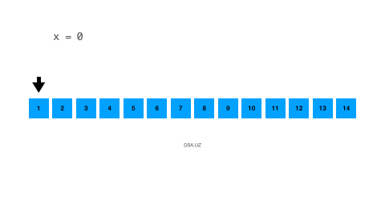

# Big O notation

Miqdorlarni o'lchash uchun hayotda turli hil o'lchov birliklaridan foydalanamiz. Uzunlik uchun santimetr, suv uchun litr, og'irlik uchun
tonna/kilogram/gram/miligram va h.k.z.larni misol qilishimiz mumkin. Huddi shunday dasturlashdagi ko'p narsalarni ham o'lchash uchun
o'lchov birliklari bor. 

Algoritm va Ma'lumotlar Strukturasini o'lchash uchun esa biz odatda 3 xil o'lchov birligidan foydalanamiz.

1. **Big O notation** - Vaqt va Xotira murakkabligini eng maksimum qiymatini o'lchash uchun ishlatiladi. Uning vazifasi bizning Algoritm 
yoki Ma'lumotlar struktuamiz eng yomon holat(worst-case)da qanday ishlashini tasvirlaydi.
2. **Theta notation** - Vaqt va Xotira murakkabligini o'rtacha holatini o'lchash uchun ishlatiladi. 
3. **Omega notation** - Vaqt va Xotira murakkabligini eng minimum qiymatini o'lchash uchun ishlatiladi. Uning vazifasi  bizning Algoritm 
yoki Ma'lumotlar struktuamiz eng yaxshi holat(best-case)da qanday ishlashini tasvirlash.

Dasturlarni odatda worst-case holati o'lchanadi. Chunki bu orqali siz o'z dasturingiz eng yomon holatda qanday ko'rsatgichda ishlashini 
bilib olasiz. Bu huddi marafon yuguruvchisi kasal va yugurishga loyiq emas holatida qanday natija ko'rsatishini o'lchashdek gap. Demak biz 
Big O notation nima uchun xizmat qilishini qisman tushunib oldik endi keling to'liqroq misollar bilan ko'rib chiqsak.

## Big O o'zi nima?

> "Big O notation is a mathematical notation that describes the limiting behavior of a function when the argument tends towards 
a particular value or infinity. Big O is a member of a family of notations invented by Paul Bachmann, Edmund Landau, and others, 
collectively called Bachmann–Landau notation or asymptotic notation"

> -[Wikipediadan olindi](https://en.wikipedia.org/wiki/Big_O_notation)

Tepadagi tavsifda aytilishicha **Big O** input xajmi qanchalik oshgani sari funksiya o'zini qanday tutishi, tezligi va xajmi qanday o'sishini 
tasvirlash uchun ishlatilar ekan. Misol uchun **O(n)**, **n** harfi bu yerda input hajmini bildiradi va **O()** esa algoritmni o'lchashdagi belgi
vazifasini o'taydi. Keling endi o'lchovlarni qanday qilishni o'rganib chiqsak. 

### **Constant**

Constant so'zi bu konstanta ya'ni o'zgarmas, doimiy degan ma'noni bildiradi. Agar algoritm yoki ma'lumot strukturasi harqanday inputga nisbatan
bir xil vaqt va xotira sarflasa, demak u constant bo'ladi. Uni biz Big O bilan **O(1)** deb tasvirlaymiz.

**Constant Time**: Xonangizdagi chiroqni o'chib yonishi uchun doim bir xil vaqt sarflanadi. Siz qanday tezlikda va sekinlikda 
bosmang chiroq bir xil yonadi.

**Constant Space**: Garri potter filmida bir sumka bo'ladi qancha narsa solmang ichiga kiraveradi. O'sha bitta sumka o'zgarmas xotiraga misol 
bo'la oladi. Chunki biz yuklarimizni alohida sumkalar sotib olib joylamaymiz shunchaki bittasiga qancha hohlasak shuncha joylaymiz.

### **Linear**

Linear so'zi bu chiziqli degan ma'noni bildiradi. Chiziq uzunligi o'sgani sari qiymati (sm) ham o'sib boradi. Agar algoritm yoki ma'lumot 
strukturasi har-xil inputga nisbatan har-xil vaqt va xotira sarflasa, demak u linear bo'ladi. Uni biz Big O bilan **O(n)** deb tasvirlaymiz.

**Linear Time**: Oldingizda 5ta idish mavjud va siz har bir idishni yuvish uchun 1-sekund vaqt sarflaysiz. Idishlar soni oshib borar ekan
ketkaziladigan vaqt ham oshib boraveradi. Shuning uchun ham eng yomon ko'rsatgichda siz n-ta idish uchun n-sekund vaqt sarflaysiz.

**Linear Space**: Mexmonxonada 1-kishilik xonalarni olaylik. Har bir inson uchun mexmonxona 1ta xona bersa, n-ta kishi uchun mexmonxona 
n-ta xona tayyorlashi kerak degani.

### **Square**

Square so'zi kvadrat degan ma'noni bildiradi. Agar algoritm yoki ma'lumot strukturasi berilgan inputga nisbatan uning kvadrat (input2) 
vaqt yoki xotira sarflasa, demak u square bo'ladi. Uni biz **O(n2)** deb tasvirlaymiz.

### **Logarithmic**

Agar logarifm mavzusiga tushunmasangiz unda mana bu videoni ko'ring va ushbu muammoni hal qiling.

<iframe width="800" height="315" src="https://www.youtube.com/embed/PCg9swHG540" title="YouTube video player" frameborder="0" allow="accelerometer; autoplay; clipboard-write; encrypted-media; gyroscope; picture-in-picture; web-share" allowfullscreen></iframe>

Logarifmni biz Big O da **O(log n)** deb tasvirlaymiz. Bu yerda log deyilganda asos berilmagan bilaman ammo biz asosida 2 soni turibdi 
deb tasavvur qilishimiz kerak. Ya'ni **log2 n** degani bilan teng.

Qolgan turdagi o'lchovlarni hali sayohatimiz davomida ko'rib, o'rganib, kashf qilib ketamiz.

## Mashqlar

Kelin oddiyroq misol olsak. Loop yaratdingiz va u 1dan 50gacha raqamlarni `x`ga increment qilib borsa (`x`ning boshlang'ich qiymati 0). 
Bu yerda Time/Space Complexity nima? Buning javobi:

**Time Complextiy: O(n)** 

**Space Complextiy: O(1)** 

Ammo qanaqasiga keling tushuntiraman. Siz bu yerda faqat `x` o'zgaruvchisini ochayabsiz va u loop ko'p aylnasa ham `x`ga 
qayta-qayta qiymat qo'shayabdi. Ortiqcha o'zgaruvchi ochilmayabdi. Shuning uchun ham O(1) xotira uchun sarflandi. Xotira doim bir xil bo'ladi 
hoh loop 1000 marta aylansin.

O(n) esa sizning loopingiz 50ta son bo'lgani uchun 50 marta aylanayabdi, agar o'sha 50 soni 100 bo'lsa 100 marta aylanadi. 
Agar u n bo'lsa n-marta aylanishi kerak bo'ladi shuning uchun O(n) berildi.

Yana boshqa misolni olsak, sizda 2ta array bor. Birinchi arrayda 1-100 gacha sonlar bor ammo ikkinchisi bo'sh array. Siz loop orqali 
faqat toq o'rindagi raqamlarni (juft sonlarni) qo'shadigan bir kod yozdingiz. Bu yerda Time/Space Complexity nima? Buning javobi:

**Time Complextiy: O(n/2)** 

**Space Complextiy: O(n)** 

Siz bu yerda array bo'sh ochdingiz va u unga qo'shilgan har bir qiymat uchun bitta xotira sarflaydi. Agar arry ichida 100ta element bo'lsa u 
100ta xotira sarflaydi degani. Shuning uchun siz n-ta element qo'shganingiz uchun u n-ta xotira sarflayabdi.

Siz arrayni uzunligi necha bo'lsa shuni yarmini qilayabsiz ya'ni har bir iteratsiyada 2ta qadam tashlayabsiz. Bu degani array o'lchami 100 bo'lsa,
loop 100/2=50 ta iteratsiya bo'ladi degani. Shuning uchun ham array hajmi n-ta bo'lsa siz n/2 ta iteratsiya qilasiz.

Kelasi darslarimizda topshiriqlar va savollar bilan bilmingizni tekshiramiz...