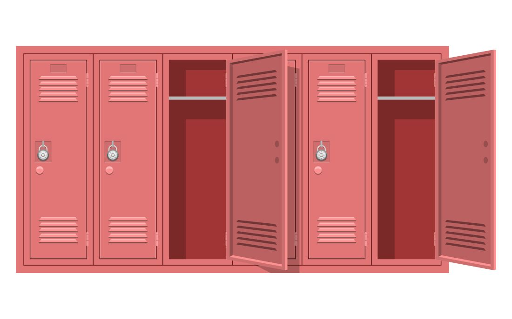
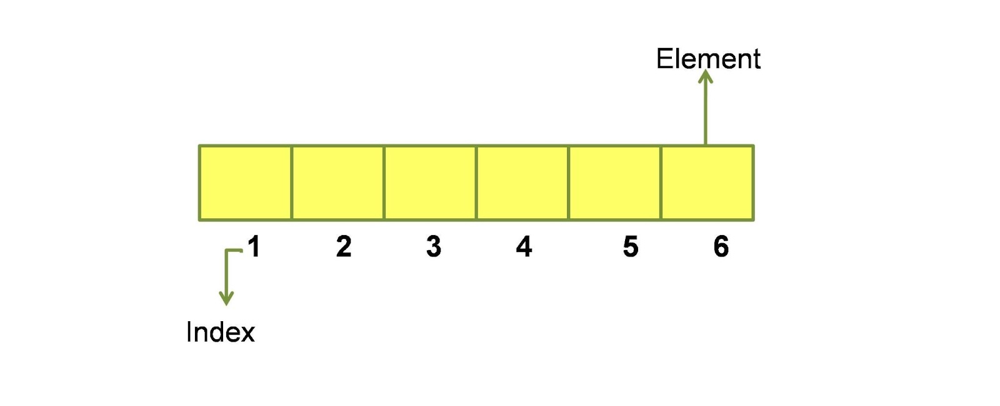
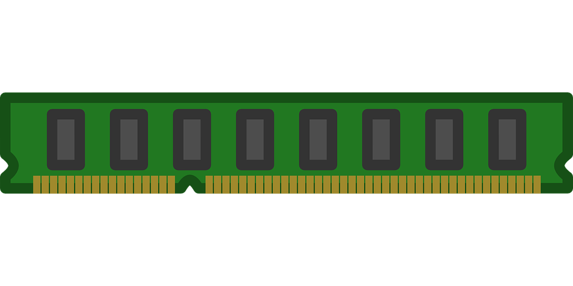
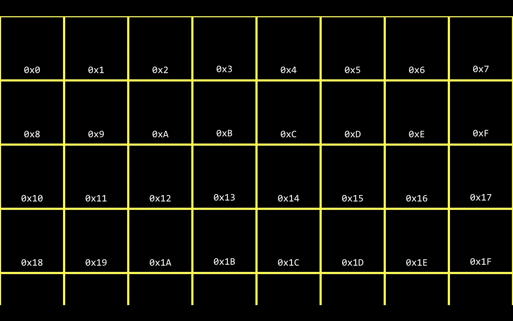
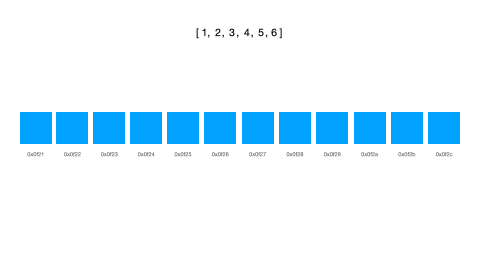

# **Array**

**Array** Amerika filmlaridagi maktablarda qatorma-qator turadigan "Locker" ya'ni "Shakf" desak bo'ladi. Barcha shkaflarning xajmi 
bir xil bo'ladi va ular o'z ichiga faqat bir narsani sig'dira oladi. O'quvchilar esa shkaflarni adashtirib yubormaslik uchun shkaflar
ustida o'zini joylashgan o'rniga qarab raqam qo'yilgan bo'ladi. Siz o'z shkafingizni aynan shu raqam orqali topishingiz mumkin.

Dasturlash tillarida array bir xil turdagi ma'lumotlarni saqlovchi huddi shunday shkaf vazifasini bajaradi. Har bir shkaf bu 
**element** degani. Biror elementni tez topish uchun unga beriladigan raqamni esa biz **index** deb olsak bo'ladi.

## U qanday ishlaydi?

Shkaf misoliga yana bir bor qaytsak. Siz har bir shkaf ichiga bir xil turdagi va o'lchamdagi narsalarni joylab borasiz.
Birinchi shkafning raqami doim 0-dan boshlanadi va shu bilan 0, 1, 2, 3, 4, ... o'ng tomonga qarab o'sib ketaveradi.

Qachonki biz o'zgaruvchi ochib unga qiymat berganimizda, ular kompyuterning **RAM** (Random Access Memory) qismida joylanadi.
RAMning o'ziga yarasha kamchilik va avfzalliklar mavjud. Avfzalliklaridan biri bu tezkorligi, juda tez kirish va 
o'zgartirish imkoniyatini beradi. Kamchiliklaridan biri dastur yoki kompyuter o'chsa yoki to'xtasa saqlangan ma'lumotlar ham o'chadi.

RAMda xotira manzillari mavjuda va ular tahminan yuqoridagi rasmdagidek kataklardan iborat. Ba'zan ularni biz 
**memory location** deb ataymiz. Har bir manzil **[Hexadecimal](https://en.wikipedia.org/wiki/Hexadecimal)** ya'ni 16-lik sanoq 
tizimida raqamlangan bo'ladi.

Array yaratib uning soni va ichidagi qiymatlarini kiritganingizda dasturingiz RAMga murojaat qiladi va ung o'shancha sondagi 
ketma-ketlikda joylashgan bo'sh kataklar kerakligini aytadi. Uni topib bo'lgach esa u elementlarni xotirada ketma-ket saqlaydi.
Va sizga elementlarga kirishingiz va ularni tez topishingiz uchun birato'la run time vaqtida index ham berib ketadi.

## U qanday yaratiladi?

Ko'plab dasturlash tillarida array yaratish uchun to'rtburchak `[...]` qavslar ishlatiladi. O'zingiz hohlagan dasturlash 
tilida ularni qanday yaratilishini bilmoqchi bo'lsangiz yuqoridan **Tillar** bo'limi orqali dasturlash tilini tanlashingiz mumkin.

