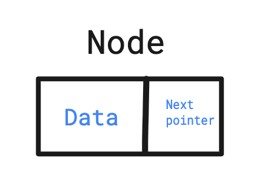
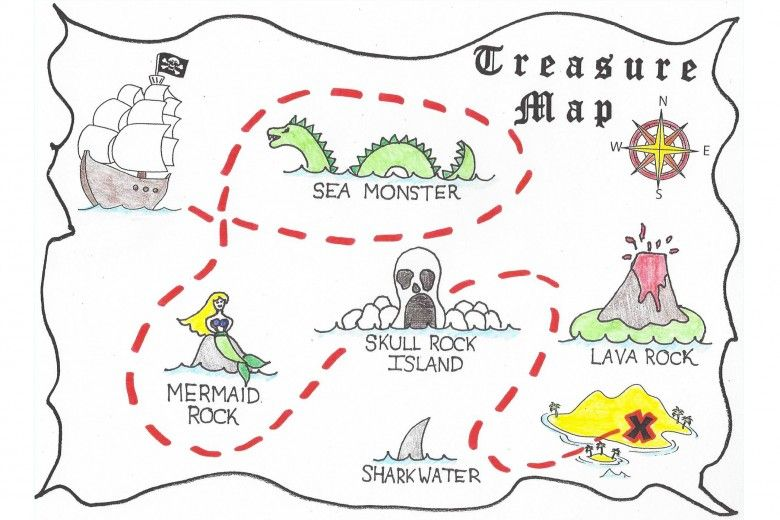
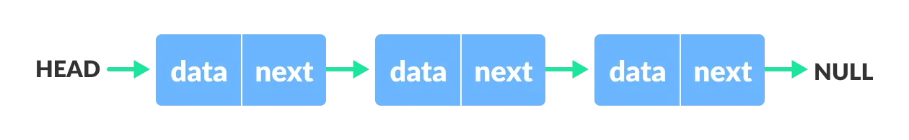
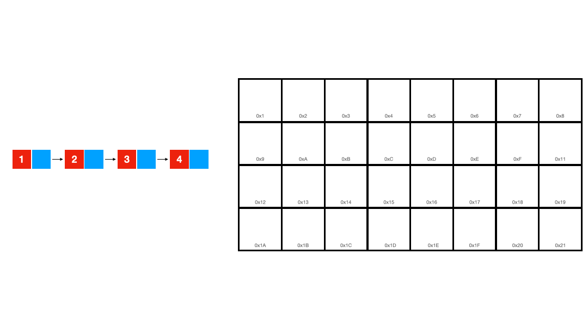
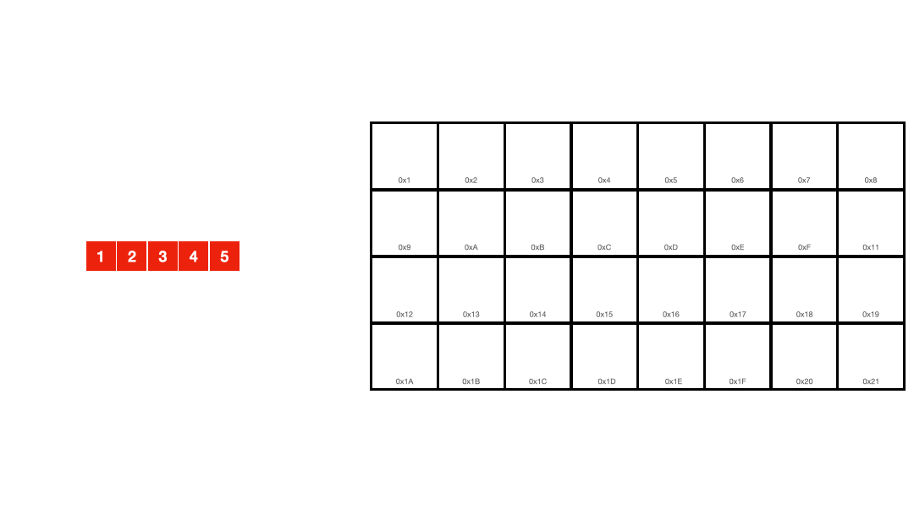
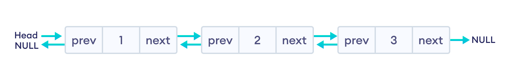

# Linked List

Linked List bu linear bo'lgan data structure bo'lib, elementlar xotiradan ketma-ket joylashmaydi. Buning o'rniga har bir elementlar
o'zidan keyingi elementga pointer vazifasini bajaradi ya'ni ular keyingi element xotirani qaysi qismida joylashganini biladi.

Linked List ma'lumot tuzilmasi **Node** degan tushunchani ilg'or suradi. Har bir **Node**da ma'lumot va keyingi node uchun pointer 
ya'ni narigi Nodeni manzili saqlanadi. 

Agar Treasure Map o'yinini o'ynagan bo'lsangiz, xaritadan xazinaga borasiz va u yerda xazina 
o'rniga yana bir yo'l uchun xarita bo'ladi. Shu tariqa siz yo'llardan o'tib oxiri xazinaga borasiz. Shu anana Linked Listda ham bor.

Linked Listda yana bir narsa mavjud va u **head**. Ha uni boshi bor )

Birinchi **node** odatda **head** deyiladi va qolganlari esa oddiy **node**lar bo'ladi. Oxirgi next doim `null` bilan tugaydi.
Keyingi node bo'lmagani uchun ham oxirgi node `null` bilan tugaydi. Agar yangi `node` qo'shsangiz u null emas o'sha `node` ni 
**memory location**nini saqlab turadi.

Linked Listning bir nechta turlari mavjud va ular:

1. Singly Linked List 
2. Doubly Linked List
3. Circular Linked List

> Hech bir dasturlash tilida standart data type qilib Linked Listni uchratmaysiz shuning uchun ham uni o'zingiz tuzib chiqasiz. 
O'zingizga qulay dasturlash tilida bu qanday qilinishni o'rganib chiqing.

## Singly Linked List

Yuqorida keltirilgan rasmda biz aynan Singly Linked Listni keltirib o'tganmiz. U yerdagi har bir node `data` va `next` 
attributelaridan iborat. `data` biz bergan ma'lumotni o'zida saqlasa, `next` keyingi nodeni joylashuvini saqlaydi. Sizda savol
paydo bo'lishi mumkin: "Array bilan farqi nimada buni?".

Keling qisqacha Array va Linked Listni farqini ko'rsak. Birinchi Linked List qanday ishlashiga qarang:

Endi esa Array qanday ishlashiga qarang:

Ko'rib turibsizki bu yerda Array ma'lumotlarni ketma-ket xotirada saqlayabdi va xotiradan ma'lumotni tezkor olish uchun 
indekslar yaratilayabdi. Indekslar shunchaki xotiraning manziliga ulangan sonlar vazifasini o'taydi. Shuning uchun ham biz arrayda
istalgan qiymatimizga tezkor kira olamiz. 

Linked Listda elementlarni olish uchun esa biz har bir nodega kirishimiz va uning `data`si biz qidirgan qiymatmi yo'qmi tekshirib 
chiqishimiz kerak bo'ladi.  

## Doubly Linked List

Doubly Linked List oddiy Linked Listdan farqi shundaki oddiy Linked Listni node-ida `data` va `next` bo'lsa, Doublyda 3ta 
`previous`, `data` va `next` bo'ladi. Pastdagi rasmda tasvirlangan:

To'liqroq ko'rinishi esa mana bunday bo'ladi:

## Circular Linked List

Circular Linked Listning node-i odatda Singly Linked Listniki bilan bir xil bo'ladi va uning bitta o'zgacha jixati uning oxiri `null`
emas balkim `head` bo'ladi. Xuddi rasmda keltirilganidek:

Bu bekorga Circular Linked List deb atalmagan, ya'ni u aylana shaklida bo'lib uning oxiri yo'q. Biroz qiyindek tuyulishi mumkin ammo 
ishoning juda oson.

## Operatsiyalar

Linked List ustida amallar bajarish uchun juda ko'plab operatsiyalar mavjud:

- **Traversal** - biror elementni olish uchun.
- **Insertion** - yangi node qo'shish uchun.
- **Deletion** - mavjud elementni o'chirish uchun.
- **Search** - biror nodeni qidirish uchun.
- **Reverse** - teskari qilish uchun.
- **Sort** - tartiblash uchun.
- va h.k.z.

> Bularni bajarish uchun dasturlash tilini tanlab Linked List bo'limiga tushib o'rganing.

Amaliyot uchun dasturlash tilingizni tanlang va gazini bosing...

