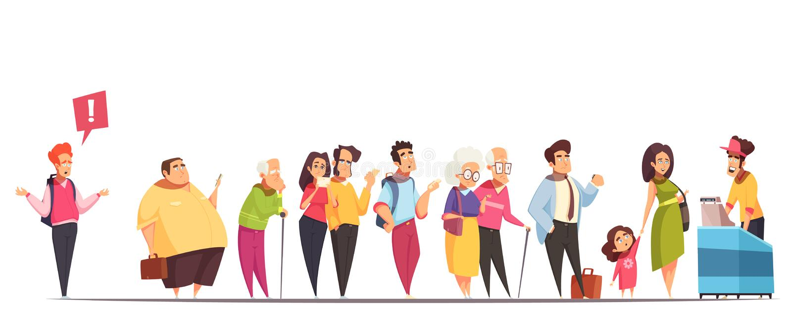
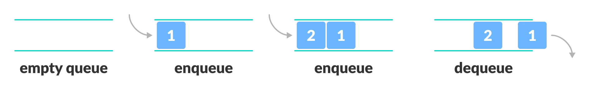
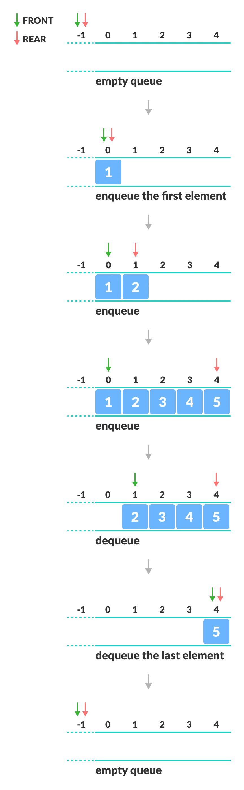

## Queue

**Queue** - 'kyu' deb o'qiladi va uning tarjimasi **navbat** degani. Deyarli ko'plab dasturlashdagi atamalar hayotiy nomlardan olingan va ularni 
hayotimizdagi ko'plab narsalarga o'xshatsak bo'ladi. 

### FIFO tamoyili

Queue **FIFO** ya'ni **First In First Out** tamoyili asosida ishlaydi, tarjima qilganda "birinchi kirgan birinchi chiqadi". Va asosiy operatsiyalari:

- `enqueue(element)` - navbatga berilgan elementni qo'shish uchun ishlatiladi.
- `dequeue()` - navbatdan eng birinchi elementni olib tashlash uchun ishlatiladi.
- `peek()` - navbatning eng birinchisidagi elementni o'chirmay qaytarish uchun ishlatiladi.
- `is_empty()` - navbat to'la yoki to'la emasligini tekshirish uchun ishlatiladi.

Demak yuqoridagi rasmda uning qanday ishlashi va biz uni qanday tasavvur qilsak bo'lishi tasvirlangan. Endi esa Stack va Queue orasidagi farqni biz 
bilamiz va ularni ajrata olamiz. Stack LIFO tamoyili asosida ishlasa, Queue FIFO tamoyili asosida ishlaydi.

Yana bir narsa Queuedagi birinchi element tomoni queuening `Front` tomoni deyiladi ya'ni oldi. Uning eng oxirgi element tomoni esa `Rear` tomoni 
deyiladi ya'ni orqasi. Ularni ba'zan 'head' va 'tail' ya'ni bosh va dum ham deb atashi mumkin.

Yuqoridagi rasmda uni qanday ishlashi keltirib o'tilgan. Siz o'sha yerdan misol olishingiz mumkin. Ammo uni implementatsiya qilish ja unchalik
vahimali ish emas. 2-3 line code qo'shiladi xolos 😌.

Queueni turli xil yo'llar bilan implement qila olamiz. Ba'zi dasturlash tillarida Array ishlatsak ba'zilarida esa linked list ishlatamiz.
Asosiy faktor o'sha dasturlash tilida array qanchalik flexible (moslashuvchan) ekanligiga qarab tanlov qilinadi.

Qisqacha qilganda Stack haqida shular edi. Endi esa uni qanday qilib siz bilgan dasturlash tilida kodga tushirishni ko'rib, o'rganib, 
mashq qilib chiqing. Keyin esa sayohatni yana birgalikda davom etamiz...